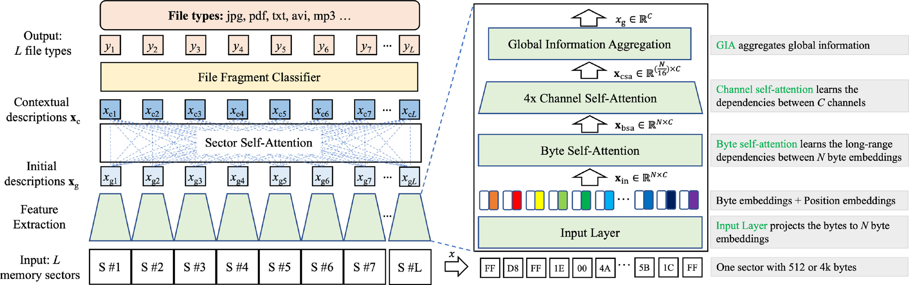
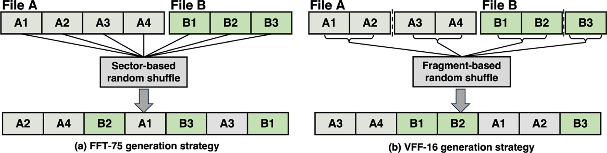
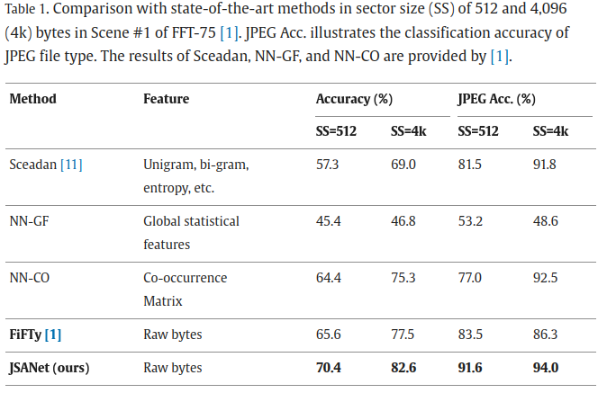
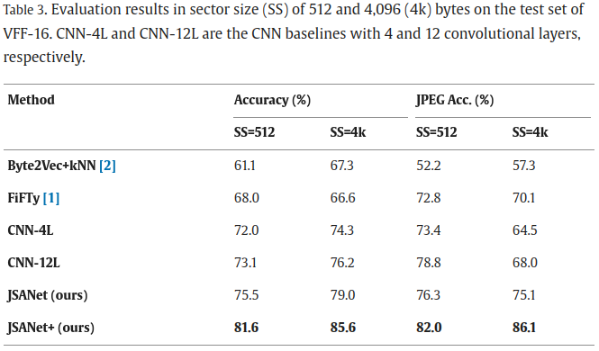
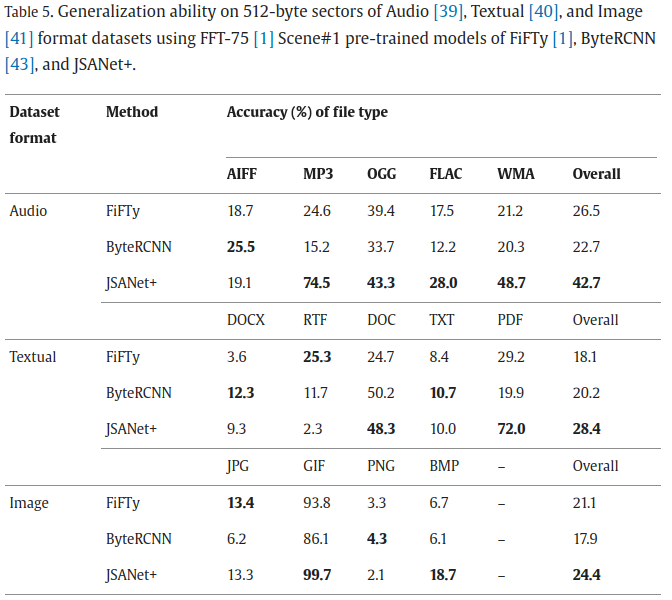
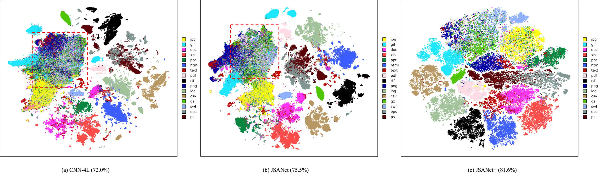

# Joint Self-Attention Network (JSANet) for File fragment classification
Official Pytorch implementation of [Intra- and inter-sector contextual information fusion with joint self-attention for file fragment classification](https://www.sciencedirect.com/science/article/pii/S0950705124002004) published at __Knowledge-Based Systems__.

Authors: Yi Wang, Wenyang Liu, Kejun Wu, Kim-Hui Yap, Lap-Pui Chau.

This code is based on the [Transformer](https://github.com/google-research/vision_transformer) applied directly to intra- and inter-bytes on file fragment classification (FFC) task.

## Introduction

File fragment classification (FFC) aims to identify the file type of file fragments in memory sectors, which is of great importance in memory forensics and information security. Existing works focused on processing the bytes within sectors separately and ignoring contextual information between adjacent sectors. In this paper, we introduce a joint self-attention network (JSANet) for FFC to learn intra-sector local features and inter-sector contextual features. Specifically, we propose an end-to-end network with the byte, channel, and sector self-attention modules. Byte self-attention adaptively recognizes the intra-sector significant bytes, and channel self-attention re-calibrates the features between channels. Based on the insight that adjacent memory sectors are most likely to store a file fragment, sector self-attention leverages contextual information in neighboring sectors to enhance inter-sector feature representation. Extensive experiments on seven FFC benchmarks show the superiority of our method compared with state-of-the-art methods. Moreover, we construct VFF-16, a variable-length file fragment dataset to reflect file fragmentation. Integrated with sector self-attention, our method improves accuracy by more than 16.3% against the baseline on VFF-16, and the runtime achieves 5.1 s/GB with GPU acceleration. In addition, we extend our model to malware detection and show its applicability.



### Contributions
* We propose an FFC approach with joint self-attention to learn the intricate dependencies in the byte, channel, and sector dimensions. To the best of our knowledge, the proposed method is the first work involving the integration of intra-sector local features and inter-sector contextual features for the FFC problem.
* We construct a variable-length dataset that contains 16 file types, each of which includes about 50MB files saved in 102,400 sectors (or samples). The dataset complies with file system fragmentation, i.e., files are separated into various-length fragments, and the file fragments are assigned to continuous sectors randomly.
* Extensive experiments on seven FFC benchmarks are conducted to validate the advantage of the proposed method against state-of-the-art methods. Experiments of model generalization, dataset validity, ablation studies, visualization, and malware detection extension demonstrate the effectiveness of the proposed method.

## Dataset
We construct a variable-length file fragment dataset with 16 file types (VFF-16), which mimics the file system fragmentation to split files. Generally, the filesystem divides a file into multiple fragments to efficiently utilize non-contiguous unallocated space by matching and filling them with corresponding fragments. Unlike FFT-75 that defines the file fragments’ size to the memory sector size, our VFF-16 splits files into various-length fragments and saves the file fragments randomly. Hence, the proposed SSA module can further extract context features between sectors.


#### Note: the code use the name of RFF instead of VFF

## Usage
### 1. Download Pre-trained model (Google's Official Checkpoint). We did not used the Pre-trained model due to the domain shift.
* [Available models](https://console.cloud.google.com/storage/vit_models/):
  * Refer to Imagenet21k pre-train + imagenet2012 fine-tuned models: ViT-B_16-224 if you intend to use.

### 2. Prepare the Datasets
* Download FFT-75 dataset from this [link](https://ieee-dataport.org/open-access/file-fragment-type-fft-75-dataset), and uncompressed it into ./data/FFT
  * The format should be ./data/FFT/512_x and ./data/FFT/4k_x, where x is the Scene of FFT-75
  * Note: Please download classes.json to ./data/FFT.
* Download VFF-16 (renamed in the code as RFF) dataset from this [link](https://ieee-dataport.org/documents/variable-length-file-fragment-dataset-vff-16), and uncompressed it into ./data/RFF
  * The format should be ./data/RFF/512 and ./data/RFF/4k
  
### 3. Train Model
Train the model using FFT-75 Scene #4 with Sector size of 512 bytes. --dataset fft4 can be changed.
```
python train.py --name fft-scene4 --dataset fft4 --model_type ViT-S_1 --train_batch_size 512 --eval_batch_size 512 --learning_rate 0.2 --num_epochs 100 --use_ca --gpus 0
```
Train the model using FFT-75 Scene #4 with Sector size of 4k bytes. --dataset fft4 can be changed.
```
python train.py --name fft-scene4_4k --dataset fft4 --emb_num 4096 --model_type ViT-S_1 --train_batch_size 512 --eval_batch_size 512 --learning_rate 0.2 --num_epochs 100 --gpus 0
```
Train the model using VFF-16 with Sector size of 512 bytes (renamed in the code as RFF).
```
python train.py --name rff_C --dataset rff --model_type ViT-S_1C --train_batch_size 512 --eval_batch_size 1024 --learning_rate 0.2 --num_epochs 128 --use_ca --gpus 0 --context_tokens 16
```
Train the model using VFF-16 with Sector size of 4k bytes.
```
python train.py --name rff_C_4k --dataset rff --emb_num 4096 --model_type ViT-S_1C --train_batch_size 512 --eval_batch_size 1024 --learning_rate 0.2 --num_epochs 128 --use_ca --gpus 0 --context_tokens 16
```

### 4. Test Model
Test the model on FFT-75 Scene #4 with Sector size of 512 bytes, using last model checkpoint (fft-scene4_checkpoint.pth) because the model is validated on the test set during training.
```
python test.py --name test --dataset fft4 --emb_num 512 --model_type ViT-S_1 --eval_batch_size 1024 --gpus 0 --use_ca --pretrained_dir output/fft-scene4_checkpoint.pth
```
Test the model on FFT-75 Scene #4 with Sector size of 4k bytes, using last model checkpoint (fft-scene4_4k_checkpoint.pth) because the model is validated on the test set during training.
```
python test.py --name test --dataset fft4 --emb_num 4096 --model_type ViT-S_1 --eval_batch_size 1024 --gpus 0 --use_ca --pretrained_dir output/fft-scene4_4k_checkpoint.pth
```
Test the model on VFF-16 with Sector size of 512 bytes, using best model checkpoint (rff_C_best.pth) on the validation set during training.
```
python test.py --name test --dataset rff --emb_num 512 --model_type ViT-S_1C --eval_batch_size 512 --use_ca --gpus 0 --pretrained_dir output/rff_C_best.pth --context_tokens 16
```
Test the model on VFF-16 with Sector size of 4k bytes, using best model checkpoint (rff_C_4k_best.pth) on the validation set during training.
```
python test.py --name test --dataset rff --emb_num 4096 --model_type ViT-S_1C --eval_batch_size 512 --use_ca --gpus 0 --pretrained_dir output/rff_C_4k_best.pth --context_tokens 16
```

## Experiment Results
Refer to the [paper](https://www.sciencedirect.com/science/article/pii/S0950705124002004) for comprehensive evaluation.

### FFT-75 (Scene #1) in Sector size (SS) of 512 and 4,096 (4k) bytes


### VFF-16: Variable-length File Fragment dataset


### Audio, Textual, and Image format datasets for evaluating generalization


### Visualization of Feature Descriptions of CNN-4L, (b) our JSANet, and (c) our JSANet+ on VFF-16 



## Reference
* [Google ViT](https://github.com/google-research/vision_transformer)
* [Pytorch Image Models(timm)](https://github.com/rwightman/pytorch-image-models)


## Citations
If you find this research project is useful for your research, please star :star: this repository and consider citing :pencil::

```bibtex
@article{wang2024intra,
  title={Intra- and inter-sector contextual information fusion with joint self-attention for file fragment classification},
  author={Wang, Yi and Liu, Wenyang and Wu, Kejun and Yap, Kim-Hui and Chau, Lap-Pui},
  journal={Knowledge-Based Systems},
  pages={111565},
  year={2024},
  publisher={Elsevier}
}
```
